# Getting started

## Setup
See the [setup documentation](https://github.com/nds-org/ndslabs/blob/master/docs/setup.md) for instructions on starting NDS Labs services.

## Tutorials
Once you have a running NDS Labs system, review the [tutorial](https://github.com/nds-org/developer-tutorial) for instructions on developing services and deploying them in NDS Labs

## Service catalog

The NDS Labs [service catalog](https://github.com/nds-org/ndslabs-specs/) repository contains example specifications and links to additional information about existing services.

## Where to get help

* [NDS Labs Google Group](https://groups.google.com/forum/#!forum/ndslabs/)
* [File an issue](https://github.com/nds-org/ndslabs/issues)
* [Find us on Gitter](https://gitter.im/nds-org/ndslabs)

## Walkthrough

### Login

From the login page you can either create a project or login to an existing profile:

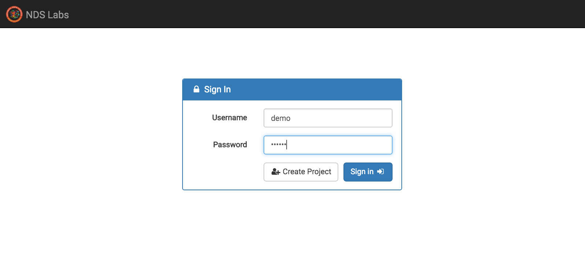

### Service list

After logging in, the list of available services is displayed on the left:
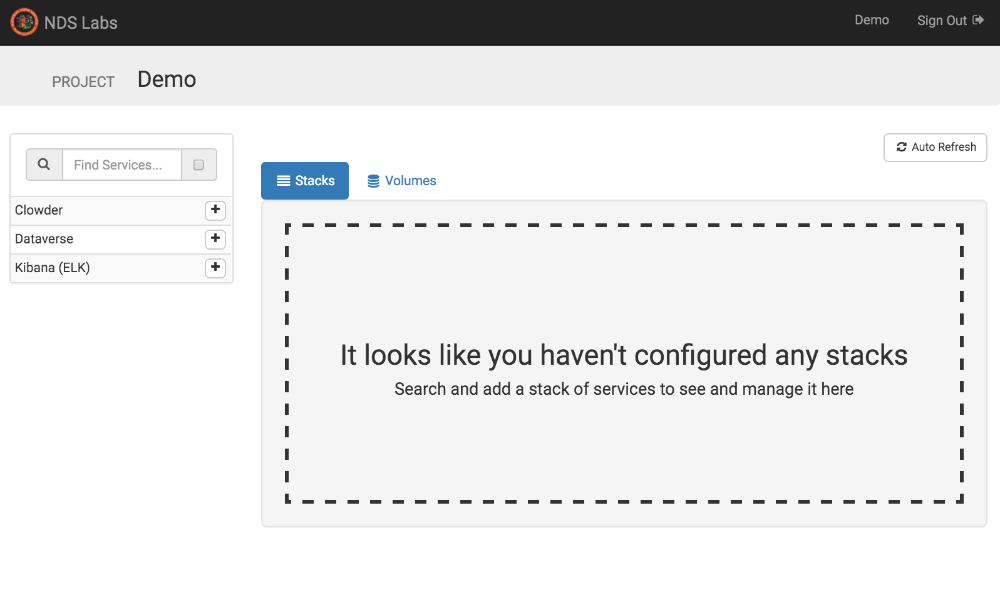

### Add ELK stack

Adding a stack displays the configuration wizard:
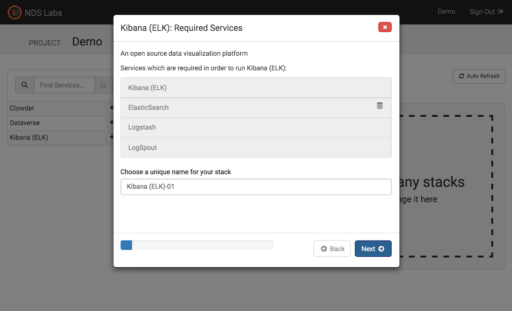

### Required services

Required services are automatically added:
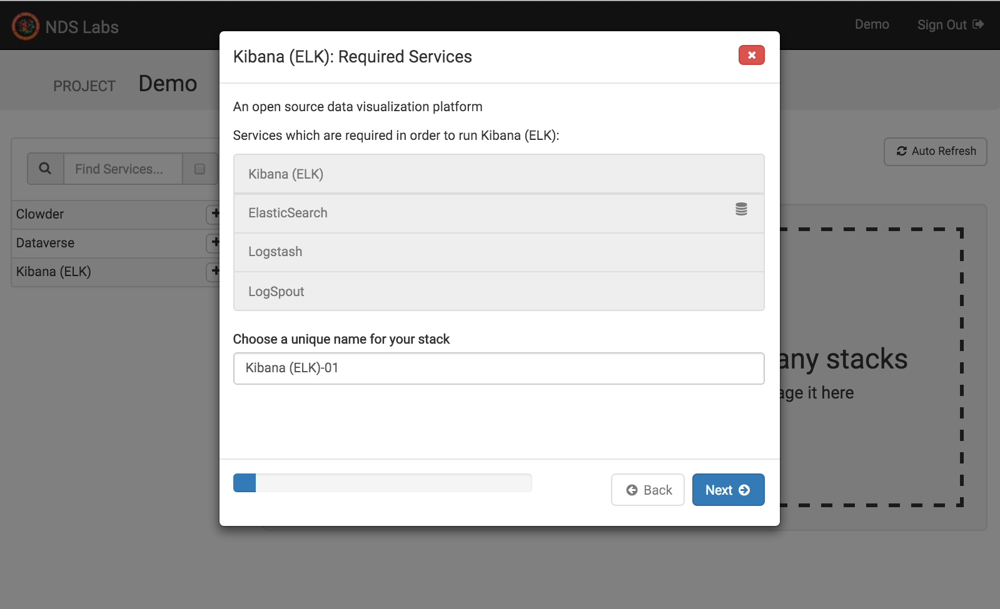

### Configure storage

If a service or dependent service requires persistent storage, you will have the opportunity to allocate storage:
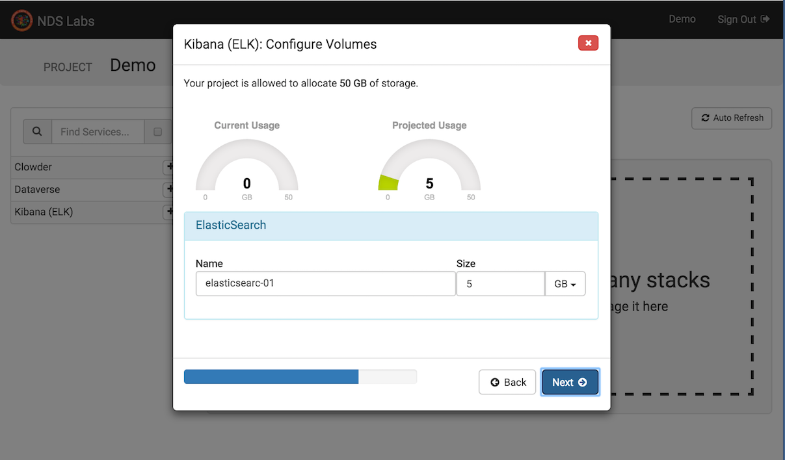

### Confirm

Confirm your configuration:
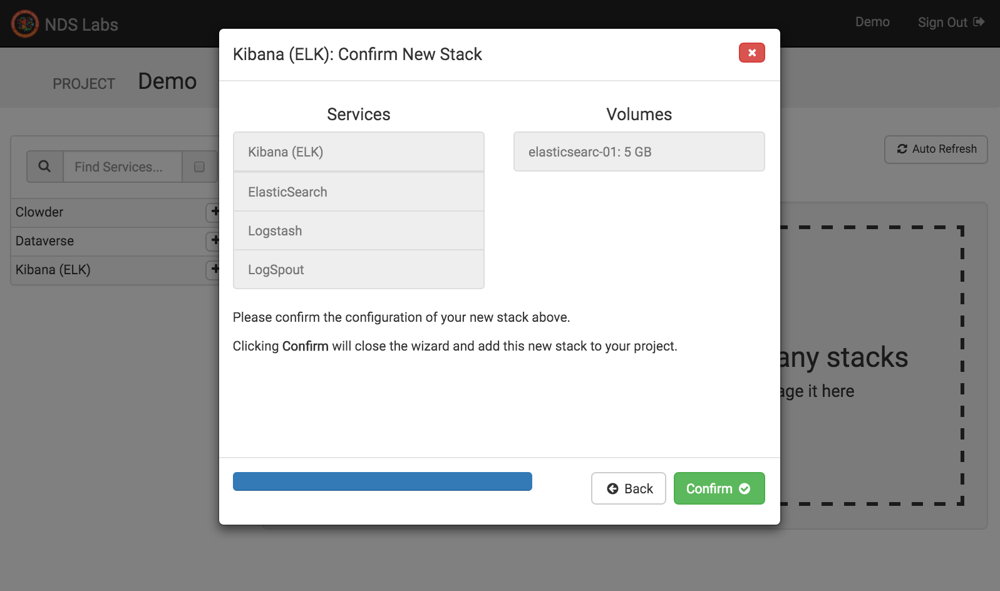

### Stopped stack

The stack is added with no services started:
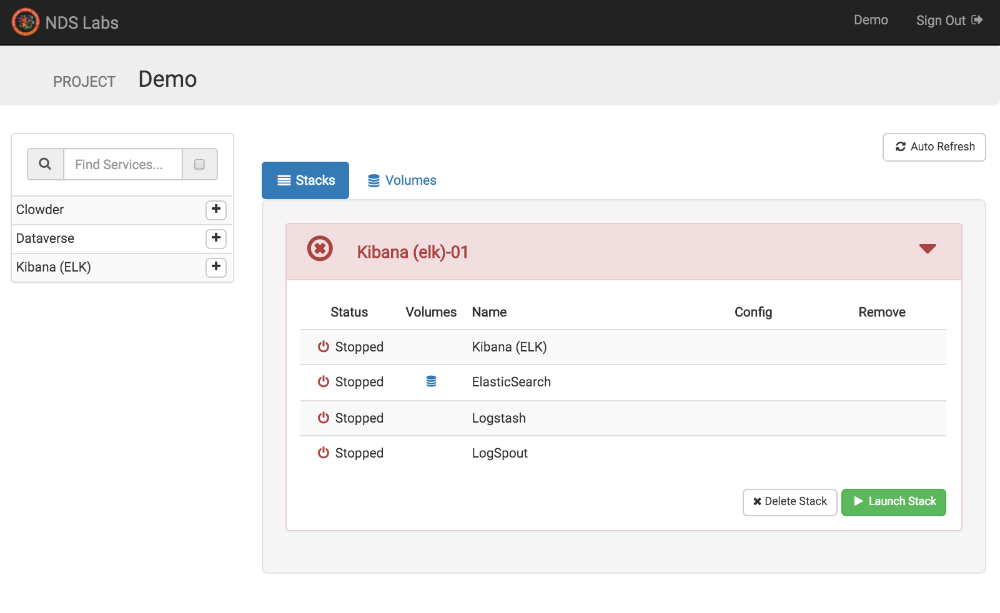

### Starting stack

Selecting "Launch stack" starts the services. Dependent services are started first:
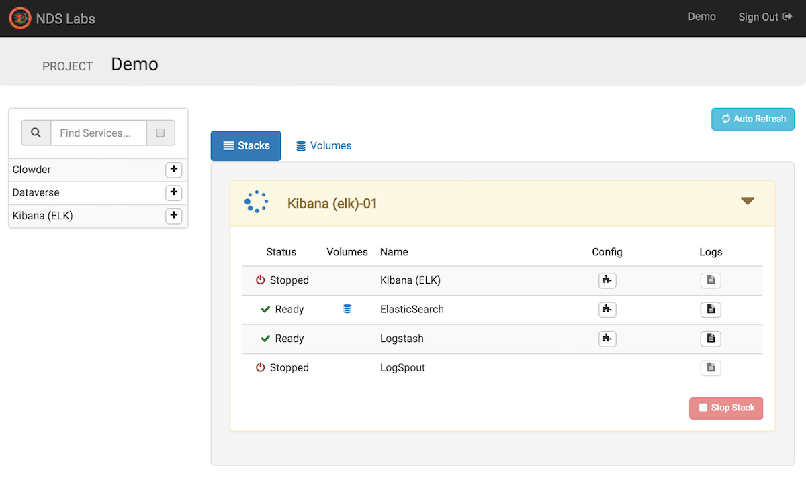

### Started stack

Once the stack is started, you can view the stack configuration, logs, or access any endpoints:
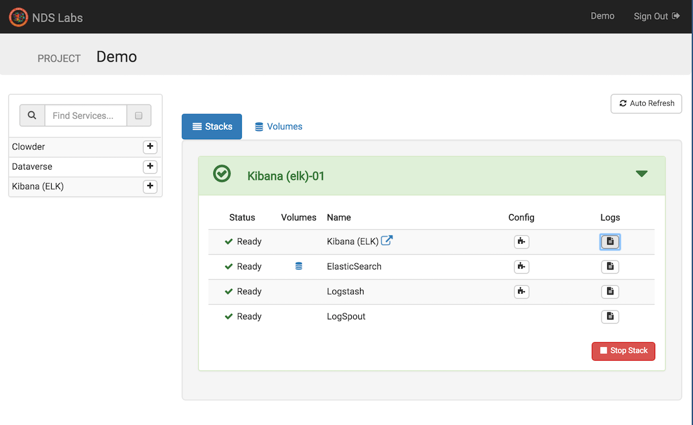

### View configuration

Viewing the configuration will show endpoint addresses or environment variables, if present:
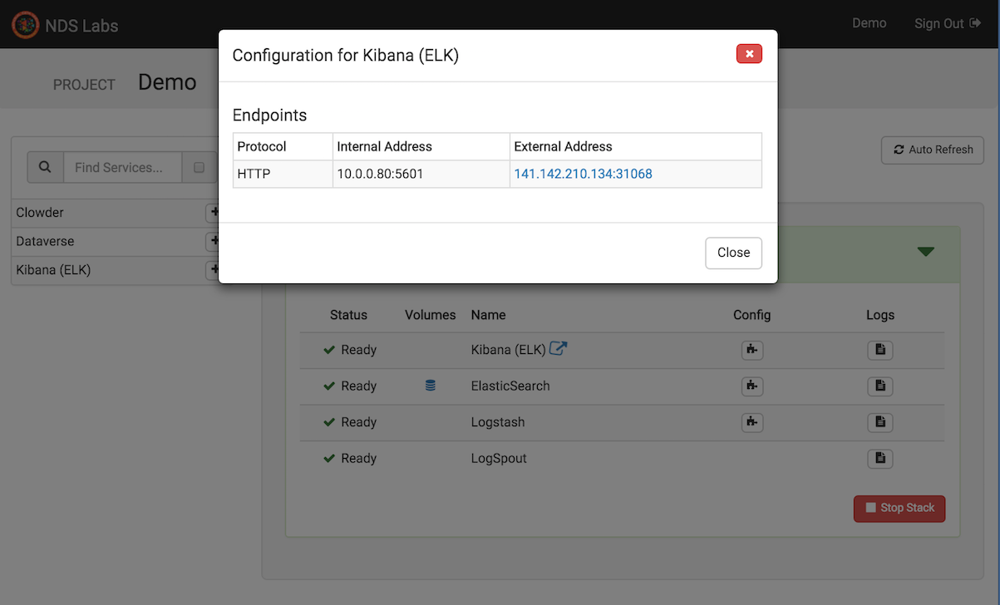

### View Kibana endpoint

Selecting the endpoint link allows access to the started service:
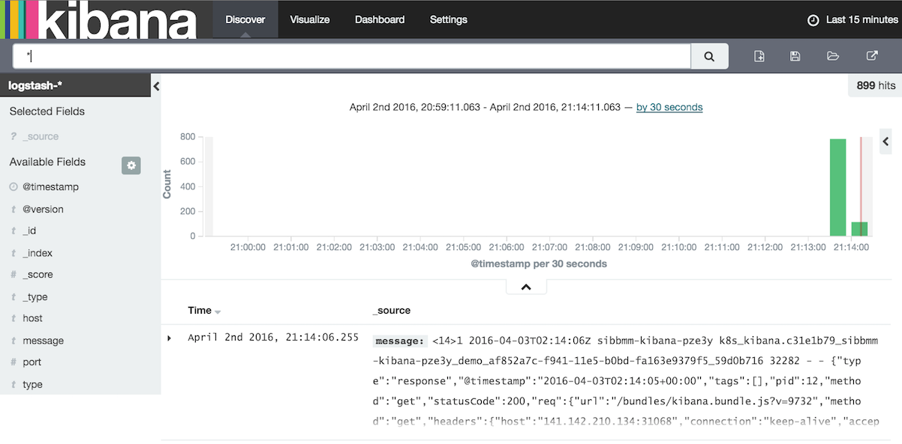

### View volumes
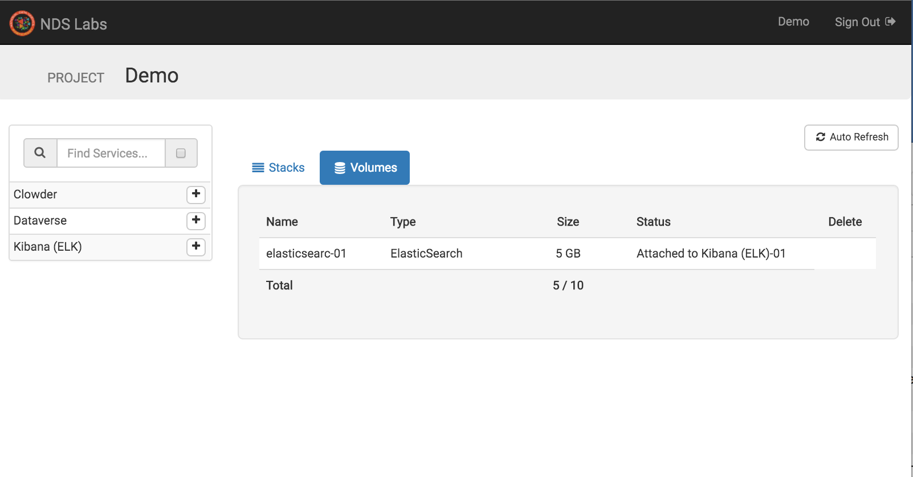

